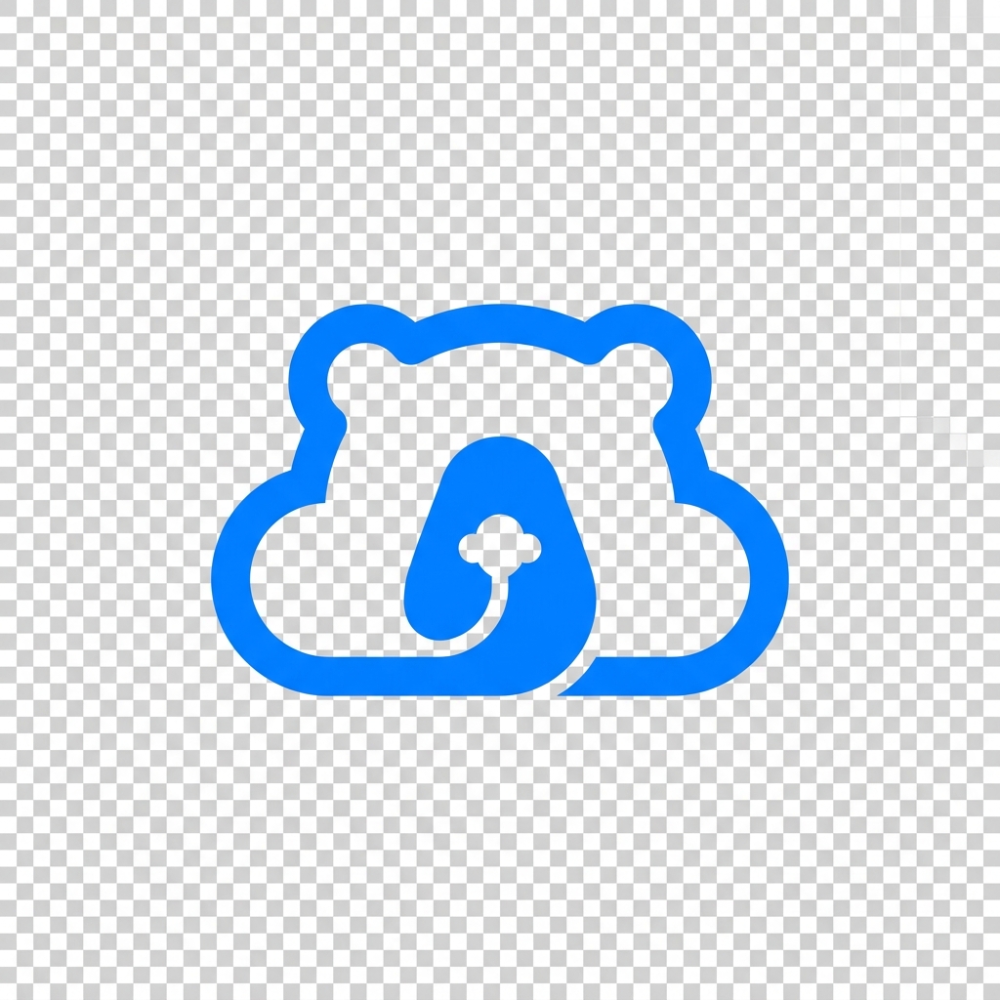
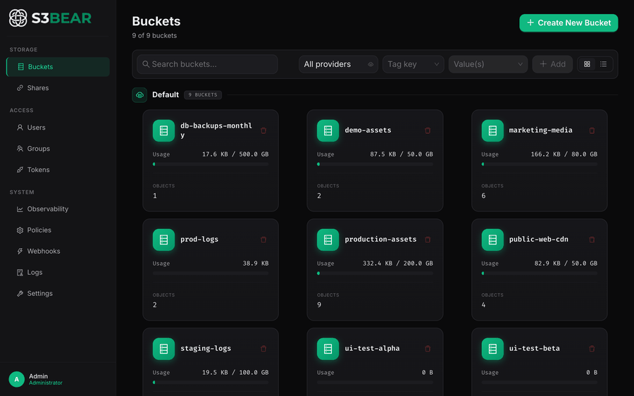
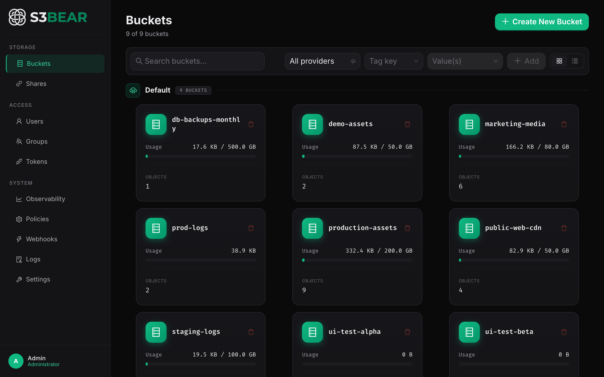
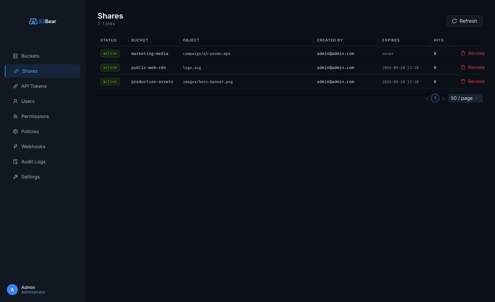
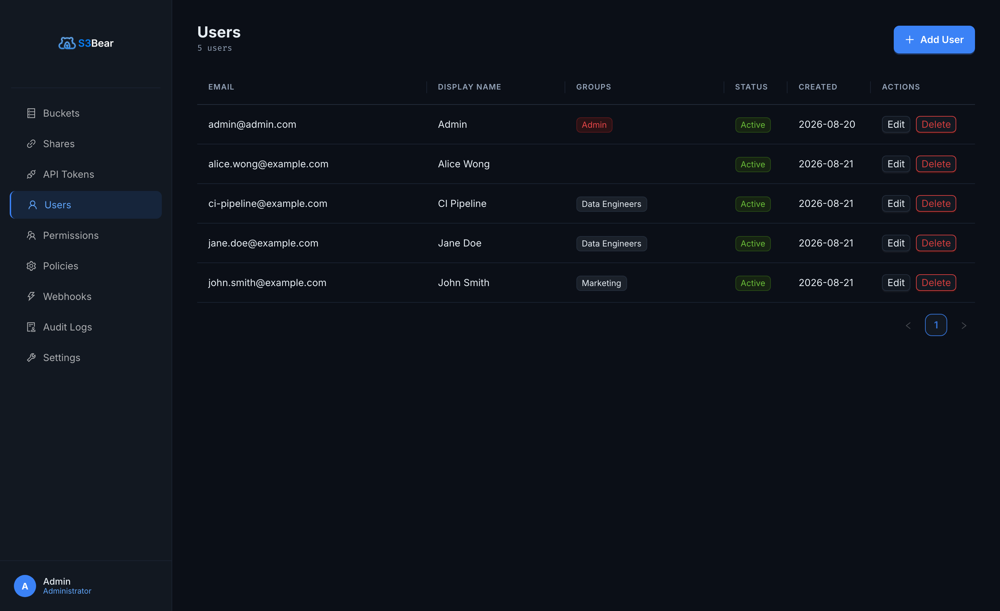
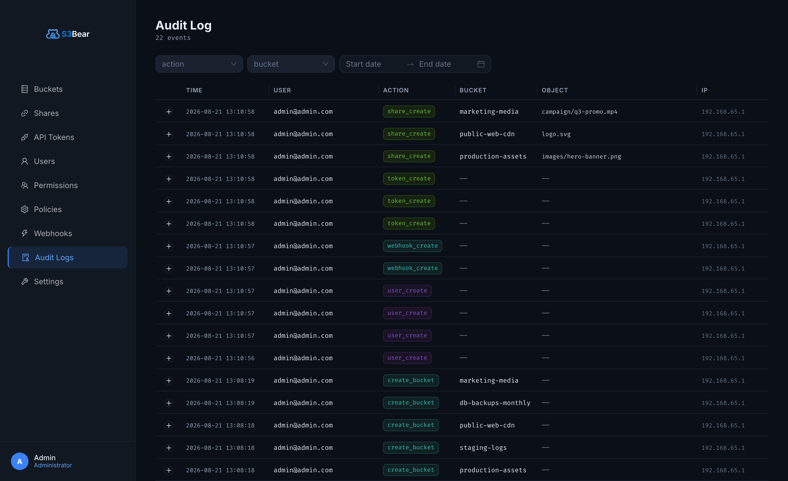

<div align="center">



# s3BEAR

### Secure S3 Gateway for AI Workloads

**Serve images and files from private S3 storage to LLMs and browsers —
without ever making a bucket public.** One gateway enforces per-user permissions,
expiring links, and audit logging in front of any S3-compatible backend.

<br/>

[](#quick-start-60-seconds)
[](#demo)
[](HOW-TO.md#kubernetes-deployment-helm)
[](HOW-TO.md)

<br/>

[](#license)
[](HOW-TO.md)
[](HOW-TO.md)
[](HOW-TO.md#kubernetes-deployment-helm)
[](HOW-TO.md)

</div>

---

## Demo

<div align="center">



*30-second tour: connect storage, browse buckets, mint an expiring link, feed it to an LLM.
[How the demo GIF is produced →](assets/DEMO.md)*

</div>

---

## The Problem

Multimodal LLMs (Claude, GPT-4o, Gemini) take images as **HTTPS URLs**. But your images
live in a **private** S3 bucket. So teams reach for bad options:

- **Make the bucket public** — now anything in it is exposed to the whole internet, forever.
- **Hand-roll presigned URLs** — scattered across scripts, no central control, hard to revoke, easy to leak.
- **Proxy through app code** — every service re-implements auth, MIME checks, and rate limits.

There is no single, governed door between your private storage and the outside world.

## The Solution

s3BEAR is that door. It sits in front of **any** S3-compatible backend (AWS S3, MinIO,
Ceph, Wasabi) and becomes the **only** access path. Storage stays private at the S3 level;
s3BEAR decides — per user, per link, per request — what gets out.

- **Mint an expiring, revocable HTTPS URL** for one object and pass it straight to an LLM API. It works while valid, then returns `410 Gone`. The bucket is never public.
- **Serve images to the browser** from private buckets with JWT permission checks and a MIME allow-list — no public exposure.
- **Resize on the fly** (`?w=1024&format=webp&q=80`) so you hand right-sized images to models instead of raw originals.
- Every request is **permission-checked, quota-limited, and audit-logged** in one place.

---

## Why s3BEAR

| | |
|---|---|
| **AI-ready URLs** | Turn any private object into a stable HTTPS URL an LLM can fetch — expiring, revocable, transformable. |
| **Private by default** | The S3 bucket is never made public. s3BEAR is the single gated access path; expired or revoked links return `410`. |
| **Central permissions + audit** | Group-based glob permissions (`marketing-*`) per action, per-bucket quotas, and an audit trail of every state-changing operation. |
| **Self-host anywhere** | One Docker command to try it; a Helm chart for production Kubernetes. Bring your own S3 or run embedded MinIO. |

Full capability list — multipart upload, bulk operations, scheduled cleanup, webhooks,
Azure Entra SSO, personal access tokens — is in **[HOW-TO.md](HOW-TO.md)**.

---

## Quick Start (60 seconds)

```bash
cp .env.example .env   # fill in your credentials
docker compose -f docker-compose.dev.yml up -d
```

| Service | URL |
|---------|-----|
| Frontend | http://localhost:3100 |
| Backend API | http://localhost:8200 |
| MinIO Console | http://localhost:9001 |

Default admin: `admin@admin.com` / `admin` — **change this in production.**

Detailed setup, migrations, Kubernetes/Helm, and CORS: **[HOW-TO.md](HOW-TO.md)**.

---

## Screenshots

<table>
<tr>
<td width="50%"><b>Buckets</b><br/></td>
<td width="50%"><b>Expiring share links</b><br/></td>
</tr>
<tr>
<td width="50%"><b>Users & groups</b><br/></td>
<td width="50%"><b>Audit log</b><br/></td>
</tr>
</table>

More screens (sign-in, storage & auth settings, webhooks) are in **[HOW-TO.md](HOW-TO.md)**.

---

## Documentation

- **[HOW-TO.md](HOW-TO.md)** — architecture, API surface, configuration, and a feature-by-feature technical guide with real-world use cases
- **OpenAPI** — `http://<backend>/docs` (Swagger UI) and `http://<backend>/redoc`

## License

MIT — see [LICENSE](LICENSE).
